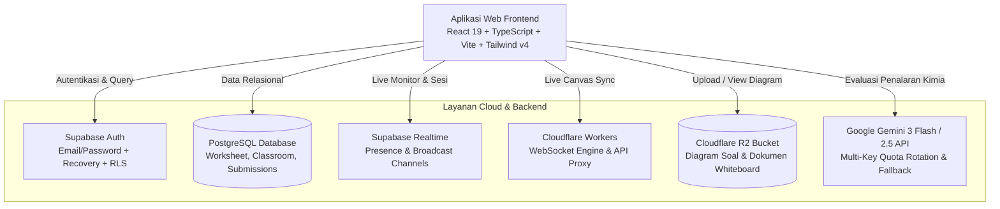

# ⚛️ OSN Kimia Mastery

> **Platform Terpadu Pembinaan Olimpiade Sains Nasional (OSN) Kimia SMA & IChO Standar Puspresnas / BPTI**  
> Dilengkapi gamifikasi silabus komprehensif, lembar kerja interaktif formula KaTeX $\text{mhchem}$, evaluasi cerdas multi-step berbasis AI, papan tulis interaktif STEMBoard, dan studio pemantauan guru *realtime*.

[](https://react.dev/)
[](https://www.typescriptlang.org/)
[](https://vitejs.dev/)
[](https://tailwindcss.com/)
[](https://supabase.com/)
[](https://workers.cloudflare.com/)
[](LICENSE)

---

## 📖 Daftar Isi
- [Latar Belakang & Visi](#-latar-belakang--visi)
- [Fitur Utama](#-fitur-utama)
  - [1. 10 Modul Silabus Kompetensi OSN & Kurikulum Merdeka](#1-10-modul-silabus-kompetensi-osn--kurikulum-merdeka)
  - [2. Lembar Kerja Interaktif (Interactive Worksheet)](#2-lembar-kerja-interaktif-interactive-worksheet)
  - [3. Evaluasi Cerdas Berbasis AI (Diagnostic AI Grading)](#3-evaluasi-cerdas-berbasis-ai-diagnostic-ai-grading)
  - [4. Papan Tulis Interaktif STEM (STEMBoard / Whiteboard)](#4-papan-tulis-interaktif-stem-stemboard--whiteboard)
  - [5. Studio Guru, SpeedGrader & Manajemen Kelas Binaan](#5-studio-guru-speedgrader--manajemen-kelas-binaan)
  - [6. Portofolio Akademik & Radar Diagnostik Siswa](#6-portofolio-akademik--radar-diagnostik-siswa)
  - [7. Optimasi Penuh Layar Mobile & Tablet](#7-optimasi-penuh-layar-mobile--tablet)
- [Arsitektur & Tech Stack](#-arsitektur--tech-stack)
- [Struktur Proyek](#-struktur-proyek)
- [Panduan Instalasi & Menjalankan Lokal](#-panduan-instalasi--menjalankan-lokal)
- [Konfigurasi Lingkungan (.env)](#-konfigurasi-lingkungan-env)
- [Panduan Pengujian & Build](#-panduan-pengujian--build)
- [Kontributor & Pembuat](#-kontributor--pembuat)

---

## 🎯 Latar Belakang & Visi

Persiapan menuju Olimpiade Sains Nasional (OSN) Kimia hingga jenjang International Chemistry Olympiad (IChO) menuntut penguasaan konsep teoritis yang mendalam, penalaran matematika yang presisi, serta kemampuan menuliskan notasi reaksi kimia dengan sintaks yang benar.

**OSN Kimia Mastery** hadir untuk menjembatani kesenjangan fasilitas pelatihan antara siswa dan pembina sekolah melalui:
1. **Penalaran Terstruktur (Scaffolding):** Membiasakan siswa menyelesaikan soal dengan 4 pilar penalaran sistematis, bukan hafalan rumus instan.
2. **Umpan Balik Diagnostik AI:** Menilai langkah per langkah, mendeteksi miskonsepsi kimia ilmiah (seperti konversi satuan termodinamika, penentuan bilangan oksidasi, atau perhitungan pH garam terhidrolisis), dan memberikan saran remedial otomatis.
3. **Pembinaan Kolaboratif:** Guru dapat membuat kelas, menugaskan paket soal terkurasi, dan memantau progres coretan kanvas maupun lembar kerja secara *live*.

---

## ✨ Fitur Utama

### 1. 10 Modul Silabus Kompetensi OSN & Kurikulum Merdeka
- Peta jalur pembelajaran komprehensif dari jenjang sekolah menengah (Fase E Kelas 10 & Fase F Kelas 11–12) hingga materi olimpiade tingkat lanjut (OSK, OSP, OSN, IChO).
- **10 Topik Silabus Puspresnas:**
  1. *Struktur Atom & Mekanika Kuantum* (Konfigurasi elektron, bilangan kuantum, aturan Slater).
  2. *Ikatan Kimia & Bentuk Molekul* (VSEPR, hibridisasi orbital, teori orbital molekul / MOT).
  3. *Stoikiometri & Kimia Larutan* (Hukum dasar kimia, analisis volumetri, titrasi redoks).
  4. *Termodinamika & Termokimia* (Entalpi Hess, entropi fasa, energi bebas Gibbs $\Delta G^\circ$, kesetimbangan termal).
  5. *Kinetika Reaksi Kimia* (Hukum laju, orde reaksi, metode keadaan tunak / SSA, energi aktivasi Arrhenius).
  6. *Kesetimbangan Kimia* (Azas Le Chatelier, tetapan $K_p$ & $K_c$, disosiasi gas).
  7. *Larutan Asam-Basa & Kelarutan* (Buffer Henderson-Hasselbalch, hidrolisis garam kompleks, hasil kali kelarutan $K_{sp}$).
  8. *Elektrokimia & Sel Volta* (Potensial reduksi standar, persamaan Nernst, elektrolisis Faraday).
  9. *Kimia Anorganik & Logam Transisi* (Teori medan kristal / CFT, warna kompleks d-d, sifat magnetik).
  10. *Kimia Organik & Mekanisme Reaksi* (Stereokimia R/S, reaksi substitusi $S_N1$/$S_N2$, eliminasi $E1$/$E2$, sintesis multi-tahap).

---

### 2. Lembar Kerja Interaktif (Interactive Worksheet)
- **Editor Notasi Kimia $\text{mhchem}$ & KaTeX:** Mengetik rumus kimia molekuler $\ce{BaCO3}$, ion $\ce{Fe^{3+}}$, reaksi kesetimbangan $\ce{A <=> B}$, dan pecahan matematika tingkat tinggi.
- **ChemToolbar:** Toolbar cerdas berisi pintasan rumus cepat kimia, panah reaksi bolak-balik, simbol Yunani ($\Delta$, $\alpha$, $\pi$), notasi fasa $(s, l, g, aq)$, dan notasi ilmiah ($\times 10^n$).
- **Scaffold Guide Modal:** Kerangka bimbingan 4 tahap (Identifikasi Masalah $\rightarrow$ Rumus Dasar $\rightarrow$ Substitusi Perhitungan $\rightarrow$ Verifikasi Akhir).
- **Integrasi Utilitas:**
  - *Tabel Periodik Interaktif*: Data nomor atom, massa molar $A_r$, konfigurasi elektron, dan tetapan fisika fundamental ($R, N_A, F, h, c$).
  - *Kalkulator Massa Molar Relatif ($M_r$)*: Hitung otomatis bobot molekul senyawa kimia secara instan.
  - *Viewer Diagram Soal*: Didukung penyimpanan Cloudflare R2 dengan fitur perbesaran resolusi tinggi (*pan & zoom*).
- **Penyimpanan Draft Otomatis:** Integrasi Supabase Cloud Sync dan auto-restore dari cache lokal agar progres pengerjaan tidak hilang saat koneksi terputus.

---

### 3. Evaluasi Cerdas Berbasis AI (Diagnostic AI Grading)
- **Penilaian Berbasis Rubrik Multi-Langkah:** AI mengevaluasi logika tahapan siswa secara berjenjang (bukan sekadar mencocokkan angka akhir).
- **Deteksi Miskonsepsi Kimia:** Mengidentifikasi secara spesifik kekeliruan konseptual yang sering dilakukan siswa (misal: selisih satuan Joule vs kiloJoule pada termokimia, atau penggunaan rumus asam kuat pada asam lemah bivalen).
- **Sistem Gamifikasi & XP:** Siswa memperoleh poin XP yang memperbarui level dan *streak* harian berdasarkan kualitas penalaran.

---

### 4. Papan Tulis Interaktif STEM (STEMBoard / Whiteboard)
- **Kanvas Multi-Halaman & Infinite Layout:** Dukungan kanvas bebas maupun format cetak baku (A4 Portrait/Landscape).
- **Koleksi Pena Sains:**
  - *Fineliner*: Pena presisi untuk rumus kimia dan angka matematika.
  - *Stabilo Transparan*: Menyorot teks soal tanpa menutupi tulisan di bawahnya.
  - *Laser Fading Pen*: Coretan live yang otomatis memudar dan hilang dalam 3 detik untuk sesi presentasi interaktif.
- **Instrumen Virtual Matematika & Sains:**
  - Penggaris digital interaktif (*Virtual Ruler*).
  - Busur derajat digital (*Virtual Protractor*).
  - Jangka geometri (*Virtual Compass*).
  - Pilihan kisi latar: Kertas polos, milimeter block, dot grid, dan chalkboard gelap.
- **Kolaborasi Realtime Guru-Siswa:** Sinkronisasi kanvas nirkabel via Cloudflare Workers WebSocket dan Supabase Realtime dengan kontrol izin host (Mode Kolaboratif vs Mode Menyimak).

---

### 5. Studio Guru, SpeedGrader & Manajemen Kelas Binaan
- **Manajemen Kelas Binaan Resmi:**
  - Pembuatan kelas dengan kode akses unik 6-karakter atau tautan undangan.
  - Aturan *Single Classroom Active* dengan sistem approval/persetujuan guru untuk menjaga integritas data siswa.
- **SpeedGrader Guru:** Antarmuka penilaian cepat untuk mereview pengerjaan siswa, membandingkan rubrik, dan memberikan feedback instan.
- **Live Classroom Monitor:** Guru dapat memantau lembar kerja yang sedang dikerjakan siswa secara *realtime*, mengarahkan kursor laser pada bagian soal tertentu, dan mengirimkan catatan pembimbing.
- **Worksheet Builder & Generator PDF:**
  - Rancang paket simulasi ujian mandiri dengan kurasi bank soal multi-tag.
  - Ekspor naskah lembar soal siswa (*Student Exam Paper*) dan lembar pedoman penskoran guru (*Teacher Mark Scheme*) ke format PDF siap cetak via `jspdf`.

---

### 6. Portofolio Akademik & Radar Diagnostik Siswa
- **Radar Chart 10 Topik Silabus:** Visualisasi poligon kekuatan dan kelemahan siswa berdasarkan riwayat pengerjaan aktual.
- **Heatmap Aktivitas Belajar:** Peta aktivitas pengerjaan 28 hari terakhir (*study streak*).
- **Rekomendasi Remedial Cerdas:** Menyarankan topik materi yang perlu dipelajari kembali berdasarkan evaluasi pengerjaan terakhir.

---

### 7. Optimasi Penuh Layar Mobile & Tablet
- **Responsivitas Terisolasi:** Menggunakan breakpoint Tailwind CSS modern (`lg:`, `md:`, `max-md:`, `max-lg:`).
- **Tampilan Desktop (PC/Laptop ≥ 1024px):** Layout *Side-by-Side Dual-Panel* 38%:62% dan navigasi horizontal tetap aktif 100% tanpa perubahan.
- **Tampilan Ponsel / Tablet Portrait (< 1024px):**
  - Segmented switch tab adaptif: `[ 📄 Naskah Soal ]` dan `[ ✏️ Lembar Jawaban ]` di lembar kerja siswa.
  - Tombol melayang *quick-switcher* di sudut layar ponsel untuk berpindah cepat antara membaca naskah soal dan mengetik jawaban.
  - Navigasi laci samping (*Mobile Drawer Sheet*) dengan tombol Hamburger Menu yang elegan.
  - Papan tulis *auto-collapse* di layar ponsel agar kanvas menggambar tetap luas.

---

## 🏗️ Arsitektur & Tech Stack



| Lapisan | Komponen / Pustaka | Keterangan |
| :--- | :--- | :--- |
| **Core UI** | React 19, TypeScript 5.x, Vite 6 | Arsitektur frontend modern berkinerja tinggi |
| **Styling** | Tailwind CSS v4, Google Fonts | Inter, Plus Jakarta Sans, JetBrains Mono |
| **Routing** | React Router DOM v7 | Route guards (`RequireAuth`, `TeacherOnly`, `StudentOnly`) |
| **Notasi Sains** | KaTeX 0.18 + `mhchem` extension | Formula kimia dan persamaan matematika berkecepatan tinggi |
| **Penyimpanan Dokumen** | `jspdf`, `canvas-confetti` | Ekspor PDF naskah ujian & selebrasi skor kelulusan |
| **Ikonografi** | Lucide React | Ikon antarmuka modern |
| **Database & Auth** | Supabase (PostgreSQL 15) | Row-Level Security (RLS) & REST API |
| **Cloud Engine** | Cloudflare Workers & R2 | Engine sinkronisasi WebSocket & penyimpanan aset |
| **Kecerdasan Buatan** | Google Gemini API (`@google/genai`) | Model penalaran diagnostik olimpiade sains |

---

## 📂 Struktur Proyek

```plaintext
osn/
├── cloudflare-worker/          # Script backend Cloudflare Worker (WebSocket & R2)
├── public/                     # Aset statis publik (logo, favicon, dsb.)
├── src/
│   ├── assets/                 # Aset grafik dan pendukung
│   ├── components/
│   │   ├── auth/               # Komponen proteksi rute dan modal autentikasi
│   │   ├── classroom/          # Komponen kelas binaan dan dialog keanggotaan
│   │   ├── common/             # Navbar, Footer, Tabel Periodik, KaTeXRenderer, dsb.
│   │   ├── materials/          # Pembaca materi teori dan penjelajah topik
│   │   ├── profile/            # PillarRadarChart, SubmissionHistory, RemedialCard
│   │   ├── syllabus/           # SVG Infografis Kurikulum Merdeka & Silabus OSN
│   │   ├── teacher/            # DiagramGallery, SpeedGrader, QuestionBankPicker
│   │   ├── whiteboard/         # Kanvas Whiteboard, Toolbar, Virtual Instruments
│   │   └── worksheet/          # ChemToolbar, ScaffoldGuideModal, ScalePresetToggle
│   ├── contexts/               # React Contexts (AuthContext, WhiteboardHeaderContext)
│   ├── data/                   # Data statis 10 pilar silabus, materi dasar SMA, dsb.
│   ├── lib/                    # Helper Supabase, KaTeX syntax helpers, gamifikasi
│   ├── pages/
│   │   ├── auth/               # Halaman Login, Pendaftaran Siswa, Pemulihan Sandi
│   │   ├── public/             # LandingPage publik
│   │   ├── student/            # Dashboard, Roadmap, Materi, Worksheet, Progress
│   │   ├── teacher/            # TeacherDashboard, ClassroomManager, AiQuestionStudio
│   │   └── whiteboard/         # Katalog Papan Tulis & Halaman Gambar STEMBoard
│   ├── services/               # Layanan API (aiGrading, submission, classroom, r2)
│   ├── types/                  # Definisi TypeScript Database, Worksheet, Whiteboard
│   ├── App.tsx                 # Routing konfigurasi utama & layout wrapper
│   ├── index.css               # Basis tema Tailwind CSS v4
│   └── main.tsx                # Entry point aplikasi
├── wrangler.json               # Konfigurasi Cloudflare Wrangler
├── vite.config.ts              # Konfigurasi Vite bundler
└── package.json                # Dependensi proyek
```

---

## 🚀 Panduan Instalasi & Menjalankan Lokal

### 1. Prasyarat Sistem
- **Node.js**: Versi `18.0.0` atau yang lebih baru (disarankan Node.js LTS).
- **NPM**: Versi `9.x` atau lebih baru.
- **Akun Supabase & Google AI Studio**: Untuk kunci API database dan evaluasi AI.

### 2. Kloning Repositori
```bash
git clone https://github.com/fluffykitten/osn.git
cd osn
```

### 3. Instal Dependensi
```bash
npm install
```

### 4. Siapkan Variabel Lingkungan
Salin file contoh konfigurasi:
```bash
cp .env.example .env.local
```
Lalu isi kredensial API Anda pada file `.env.local`.

### 5. Jalankan Server Pengembangan
```bash
npm run dev
```
Buka peramban Anda di `http://localhost:5173`.

---

## ⚙️ Konfigurasi Lingkungan (.env)

| Variabel | Deskripsi | Wajib? |
| :--- | :--- | :---: |
| `VITE_GEMINI_API_KEY` | Kunci API Google Gemini untuk evaluasi pengerjaan siswa | Ya |
| `VITE_GEMINI_API_KEY_2` | Kunci cadangan untuk rotasi otomatis kuota AI | Opsional |
| `VITE_GEMINI_MODEL` | Model AI Gemini yang digunakan (default: `gemini-3.6-flash`) | Opsional |
| `VITE_SUPABASE_URL` | URL Proyek Supabase | Ya |
| `VITE_SUPABASE_ANON_KEY` | Public Anon Key Supabase | Ya |
| `VITE_CLOUDFLARE_MAILER_URL` | URL Worker Cloudflare untuk pengiriman notifikasi email | Opsional |
| `VITE_CLOUDFLARE_STORAGE_URL` | URL Endpoint R2 Storage untuk gambar dan diagram | Opsional |

---

## 🧪 Panduan Pengujian & Build

### Validasi Linting
Menggunakan `oxlint` berkecepatan tinggi:
```bash
npm run lint
```

### Kompilasi TypeScript & Build Produksi
```bash
npm run build
```
Output bundel produksi yang dioptimalkan akan tersimpan di direktori `dist/`.

### Menjalankan Pratinjau Bundel Produksi
```bash
npm run preview
```

---

## 👤 Kontributor & Pembuat

Dibuat dan dikembangkan dengan dedikasi penuh untuk kemajuan pendidikan sains dan olimpiade kimia Indonesia oleh:

- **Pengembang Utama:** [fluffykitten](https://github.com/fluffykitten)
- **Kontak & Dukungan:** `fluffykitten.dev@gmail.com`
- **Lisensi:** Repositori ini dilindungi di bawah lisensi MIT. Silakan gunakan untuk tujuan pendidikan dan pembinaan olimpiade sains.
